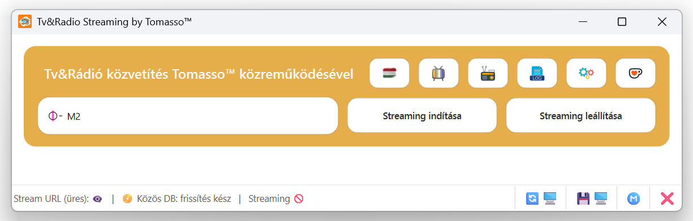
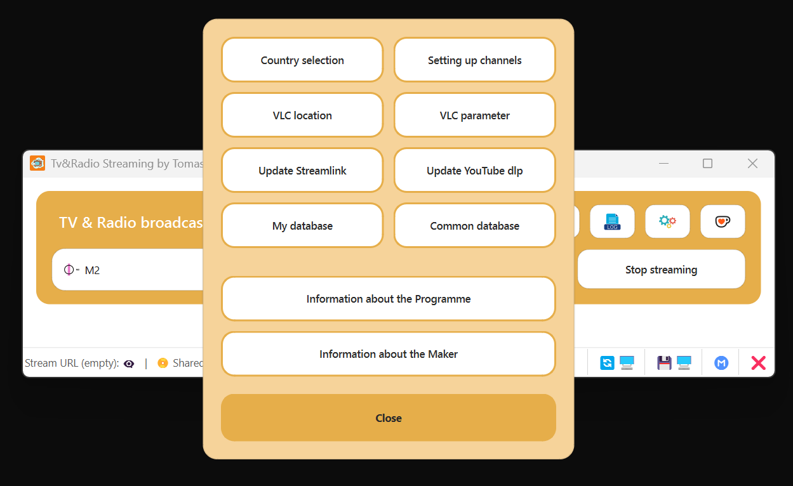
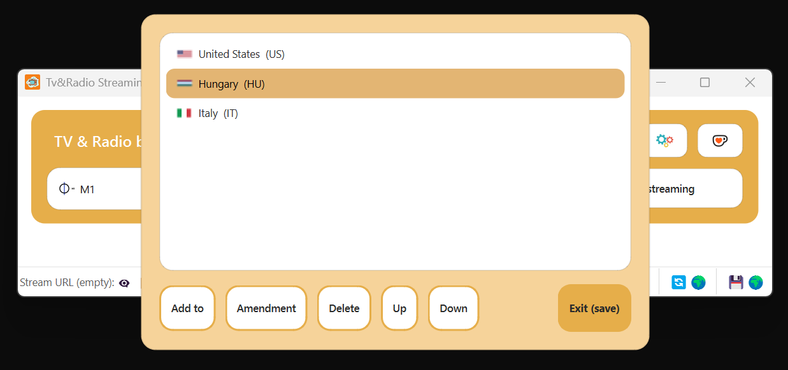
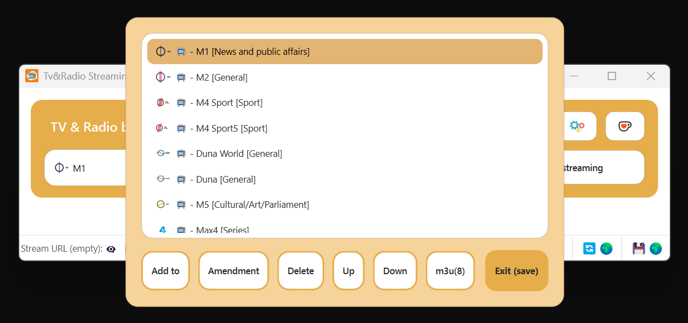
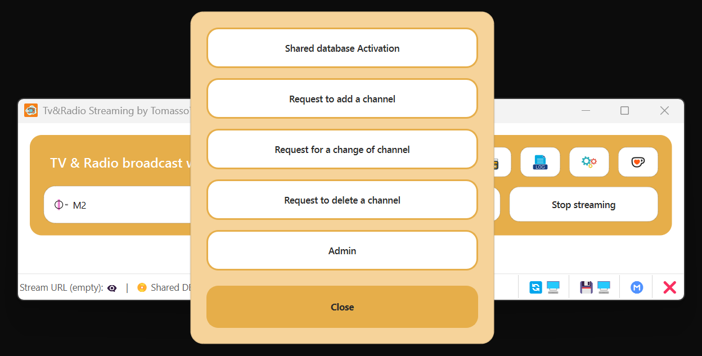
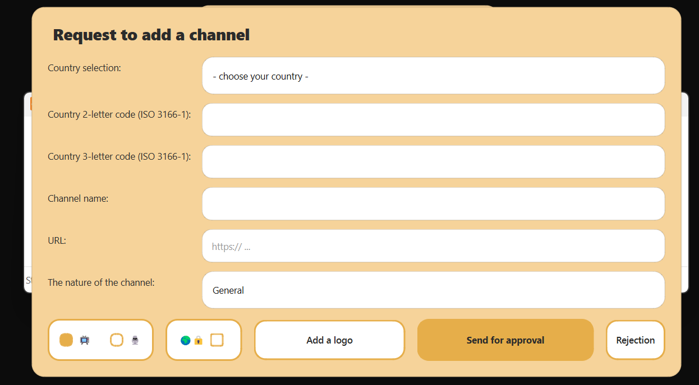

<h1 align="center">TV & Radio Streaming by Tomasso™</h1>

  A powerful desktop application for watching TV channels and listening to online radio streams
  with VLC integration, local proxy support, and flexible channel management.

  
  
  
  

# TV & Radio Streaming by Tomasso™

A powerful desktop application for watching TV channels and listening to online radio streams with VLC integration, local proxy support, and flexible channel management.

---

## 🚀 Download

Download the latest version here:  
https://github.com/btomi1980/TV-Radio-Streaming-by-Tomasso/releases/latest

---

## ✨ Features

- 📺 Watch online TV channels
- 📻 Listen to radio streams
- 🌍 Multi-language support
- ⚡ Fast streaming with local proxy support
- 🧠 Smart channel database management
- 🎛️ Full VLC integration
- 📂 M3U / M3U8 playlist support
- 🛠️ Advanced configuration options

---

## 🖼️ Screenshots

### Main interface

### Settings panel

### Country selection

### Channel list

### Shared database

### Channel request form

---

## ⚙️ Installation

1. Download the installer
2. Run the setup
3. Follow the installation instructions

---

## ▶️ Usage

1. Select a country
2. Choose a channel
3. Click **Start streaming**
4. Enjoy TV or radio streaming

---

## 🧩 Channel Management

- Add, edit, and delete channels
- Assign categories such as News, Sport, Music, and more
- Manage channel logos and metadata
- Import playlists in M3U / M3U8 format

---

## 🗄️ Database Modes

### Local database
- Full control over your own channels
- JSON-based local storage

### Shared database
- Central online source
- Local cache support
- Update and synchronization features

---

## 🧪 Technical Details

- VLC player integration
- Streamlink support
- YouTube-dlp support
- Local proxy streaming
- ISO country code support

---

## 🌍 Languages

 Albanian  
 Bulgarian  
 Chinese  
 Czech  
 German  
 Danish  
 Estonian  
 Spanish  
 Finnish  
 French  
 English  
 Greek  
 Croatian  
 Hungarian  
 Italian  
 Japanese  
 Korean  
 Lithuanian  
 Latvian  
 Norwegian  
 Polish  
 Portuguese  
 Russian  
 Swedish  
 Slovenian  
 Slovak  
 Turkish

---

## 📦 Version

**3.0**

---

## 👤 Author

**Tomasso**

---

## ℹ️ About

This application is designed to provide a flexible and powerful streaming experience for both TV and radio content in a single interface.
